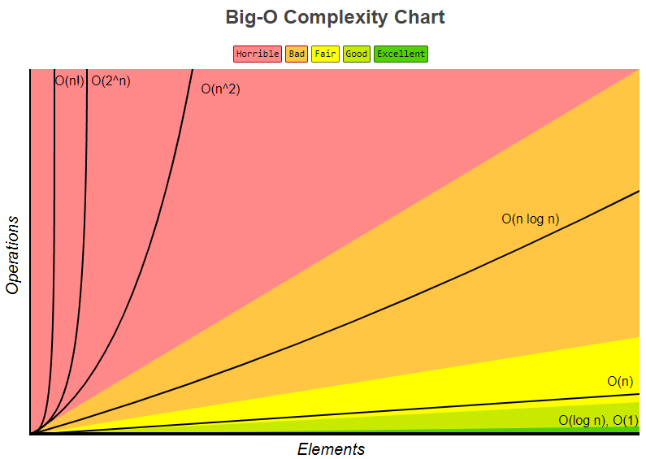
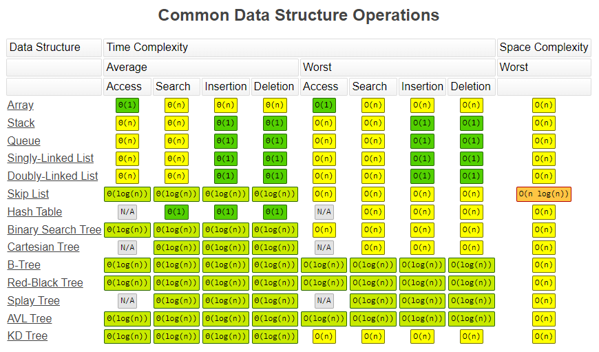
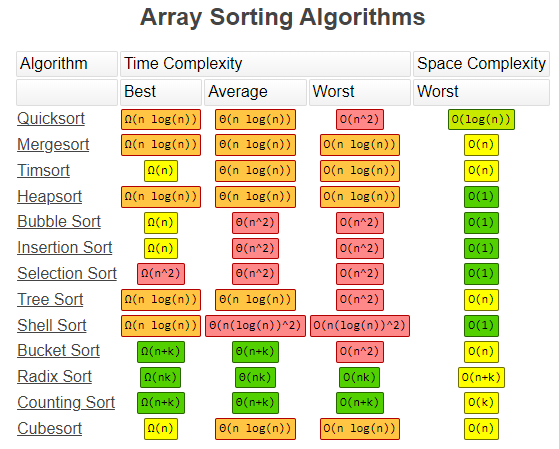

# 1. Sorting Algorithms

## 1.1. Bubble Sort

Bubble Sort is the simplest sorting algorithm that works by repeatedly swapping the adjacent elements if they are in the wrong order. This algorithm is not suitable for large data sets as its average and worst-case time complexity is quite high.

```java
// Java program for implementation of Bubble Sort
class BubbleSort {

	void bubbleSort(int arr[]) {
		int n = arr.length;

		for (int i = 0; i < n - 1; i++)
			for (int j = 0; j < n - i - 1; j++)
				if (arr[j] > arr[j + 1]) {
					// swap arr[j+1] and arr[j]
					int temp = arr[j];
					arr[j] = arr[j + 1];
					arr[j + 1] = temp;
				}
	}

	// Prints the array
	void printArray(int arr[]) {
		int n = arr.length;

		for (int i = 0; i < n; ++i)
			System.out.print(arr[i] + " ");

		System.out.println();
	}

	// Driver method to test above
	public static void main(String args[]) {
		BubbleSort ob = new BubbleSort();
		int arr[] = { 64, 34, 25, 12, 22, 11, 90 };

		ob.bubbleSort(arr);

		System.out.println("Sorted array");

		ob.printArray(arr);
	}
}
```

## 1.2. Insertion Sort

Insertion sort is a simple sorting algorithm that works similar to the way you sort playing cards in your hands. The array is virtually split into a sorted and an unsorted part. Values from the unsorted part are picked and placed at the correct position in the sorted part.

### 1.2.1. Characteristics of Insertion Sort

This algorithm is one of the simplest algorithm with simple implementation
Basically, Insertion sort is efficient for small data values
Insertion sort is adaptive in nature, i.e. it is appropriate for data sets which are already partially sorted.

```java
// Java program for implementation of Insertion Sort
class InsertionSort {
	// Function to sort array using insertion sort
	void sort(int arr[]) {
		int n = arr.length;

		for (int i = 1; i < n; ++i) {
			int key = arr[i];
			int j = i - 1;

			/*
			 * Move elements of arr[0..i-1], that are greater than key, to one position
			 * ahead of their current position
			 */
			while (j >= 0 && arr[j] > key) {
				arr[j + 1] = arr[j];
				j = j - 1;
			}

			arr[j + 1] = key;
		}
	}

	// A utility function to print array of size n
	static void printArray(int arr[]) {
		int n = arr.length;

		for (int i = 0; i < n; ++i)
			System.out.print(arr[i] + " ");

		System.out.println();
	}

	// Driver method
	public static void main(String args[]) {
		int arr[] = { 12, 11, 13, 5, 6 };

		InsertionSort ob = new InsertionSort();
		ob.sort(arr);

		printArray(arr);
	}
}
```

## 1.3. Merge Sort

The Merge Sort algorithm is a sorting algorithm that is based on the Divide and Conquer paradigm. In this algorithm, the array is initially divided into two equal halves and then they are combined in a sorted manner.

### 1.3.1. Merge Sort Working Process

Think of it as a recursive algorithm continuously splits the array in half until it cannot be further divided. This means that if the array becomes empty or has only one element left, the dividing will stop, i.e. it is the base case to stop the recursion. If the array has multiple elements, split the array into halves and recursively invoke the merge sort on each of the halves. Finally, when both halves are sorted, the merge operation is applied. Merge operation is the process of taking two smaller sorted arrays and combining them to eventually make a larger one.

```java
// Java program for Merge Sort
class MergeSort {
	// Merges two subarrays of arr[].
	// First subarray is arr[l..m]
	// Second subarray is arr[m+1..r]
	void merge(int arr[], int l, int m, int r) {
		// Find sizes of two subarrays to be merged
		int n1 = m - l + 1;
		int n2 = r - m;

		// Create temp arrays
		int L[] = new int[n1];
		int R[] = new int[n2];

		// Copy data to temp arrays
		for (int i = 0; i < n1; ++i)
			L[i] = arr[l + i];
		for (int j = 0; j < n2; ++j)
			R[j] = arr[m + 1 + j];

		// Merge the temp arrays

		// Initial indexes of first and second subarrays
		int i = 0, j = 0;

		// Initial index of merged subarray array
		int k = l;
		while (i < n1 && j < n2) {
			if (L[i] <= R[j]) {
				arr[k] = L[i];
				i++;
			} else {
				arr[k] = R[j];
				j++;
			}
			k++;
		}

		// Copy remaining elements of L[] if any
		while (i < n1) {
			arr[k] = L[i];
			i++;
			k++;
		}

		// Copy remaining elements of R[] if any
		while (j < n2) {
			arr[k] = R[j];
			j++;
			k++;
		}
	}

	// Main function that sorts arr[l..r] using
	// merge()
	void sort(int arr[], int l, int r) {
		if (l < r) {
			// Find the middle point
			int m = l + (r - l) / 2;

			// Sort first and second halves
			sort(arr, l, m);
			sort(arr, m + 1, r);

			// Merge the sorted halves
			merge(arr, l, m, r);
		}
	}

	// A utility function to print array of size n
	static void printArray(int arr[]) {
		int n = arr.length;
		for (int i = 0; i < n; ++i)
			System.out.print(arr[i] + " ");
		System.out.println();
	}

	// Driver code
	public static void main(String args[]) {
		int arr[] = { 12, 11, 13, 5, 6, 7 };

		System.out.println("Given Array");
		printArray(arr);

		MergeSort ob = new MergeSort();
		ob.sort(arr, 0, arr.length - 1);

		System.out.println("\nSorted array");
		printArray(arr);
	}
}
```

## 1.4. Selection Sort

The selection sort algorithm sorts an array by repeatedly finding the minimum element (considering ascending order) from the unsorted part and putting it at the beginning.

The algorithm maintains two subarrays in a given array.

```java
// Java program for implementation of Selection Sort
class SelectionSort {
	void sort(int arr[]) {
		int n = arr.length;

		// One by one move boundary of unsorted subarray
		for (int i = 0; i < n - 1; i++) {
			// Find the minimum element in unsorted array
			int min_idx = i;

			for (int j = i + 1; j < n; j++)
				if (arr[j] < arr[min_idx])
					min_idx = j;

			// Swap the found minimum element with the first
			// element
			int temp = arr[min_idx];
			arr[min_idx] = arr[i];
			arr[i] = temp;
		}
	}

	// Prints the array
	void printArray(int arr[]) {
		int n = arr.length;

		for (int i = 0; i < n; ++i)
			System.out.print(arr[i] + " ");

		System.out.println();
	}

	// Driver code to test above
	public static void main(String args[]) {
		SelectionSort ob = new SelectionSort();
		int arr[] = { 64, 25, 12, 22, 11 };

		ob.sort(arr);

		System.out.println("Sorted array");

		ob.printArray(arr);
	}
}
```

# 2. Big O

Big O notation is the language we use for talking about how long an algorithm takes to run. It's how we compare the efficiency of different approaches to a problem.

It's like math except it's an awesome, not-boring kind of math where you get to wave your hands through the details and just focus on what's basically happening.

With big O notation we express the runtime in terms of—brace yourself—how quickly it grows relative to the input, as the input gets arbitrarily large.

Let's break that down:

1. **How quickly the runtime grows** — It's hard to pin down the exact runtime of an algorithm. It depends on the speed of the processor, what else the computer is running, etc. So instead of talking about the runtime directly, we use big O notation to talk about how quickly the runtime grows.

2. **Relative to the input** — If we were measuring our runtime directly, we could express our speed in seconds. Since we're measuring how quickly our runtime grows, we need to express our speed in terms of...something else. With Big O notation, we use the size of the input, which we call "n". So we can say things like the runtime grows "on the order of the size of the input" (O(n)) or "on the order of the square of the size of the input" (O(n^2)).

3. **As the input gets arbitrarily large** — Our algorithm may have steps that seem expensive when n is small but are eclipsed eventually by other steps as n gets huge. For big O analysis, we care most about the stuff that grows fastest as the input grows, because everything else is quickly eclipsed as n gets very large. (If you know what an asymptote is, you might see why "big O analysis" is sometimes called "asymptotic analysis.")

If this seems abstract so far, that's because it is. Let's look at some examples.

## 2.1. Some Examples

```java
public static void printFirstItem(int[] items) {
    System.out.println(items[0]);
}
```

**This method runs in O(1) time (or "constant time") relative to its input.** The input array could be 1 item or 1,000 items, but this method would still just require one "step."

```java
public static void printAllItems(int[] items) {
    for (int item : items) {
        System.out.println(item);
    }
}
```

**This method runs in O(n) time (or "linear time"), where n is the number of items in the array.** If the array has 10 items, we have to print 10 times. If it has 1,000 items, we have to print 1,000 times.

```java
public static void printAllPossibleOrderedPairs(int[] items) {
    for (int firstItem : items) {
        for (int secondItem : items) {
            System.out.println(firstItem + ", " + secondItem);
        }
    }
}
```

Here we're nesting two loops. If our array has n items, our outer loop runs n times and our inner loop runs n times for each iteration of the outer loop, giving us n^2 total prints. Thus, **this method runs in O(n^2) time (or "quadratic time")**. If the array has 10 items, we have to print 100 times. If it has 1,000 items, we have to print 1,000,000 times.

## 2.2. N could be the actual input, or the size of the input

Both of these methods have O(n) runtime, even though one takes an integer as its input and the other takes an array:

```java
public static void sayHiNTimes(int n) {
    for (int i = 0; i < n; i++) {
        System.out.println("hi");
    }
}

public static void printAllItems(int[] items) {
    for (int item : items) {
        System.out.println(item);
    }
}
```

So sometimes nn is an actual number that's an input to our method, and other times nn is the number of items in an input array (or an input map, or an input object, etc.).

## 2.3. Drop the constants

This is why big O notation rules. When you're calculating the big O complexity of something, you just throw out the constants. So like:

```java
public static void printAllItemsTwice(int[] items) {
    for (int item : items) {
        System.out.println(item);
    }

    // once more, with feeling
    for (int item : items) {
        System.out.println(item);
    }
}
```

This is O(2n), which we just call O(n).

```java
public static void printFirstItemThenFirstHalfThenSayHi100Times(int[] items) {
    System.out.println(items[0]);

    int middleIndex = items.length / 2;
    int index = 0;

    while (index < middleIndex) {
        System.out.println(items[index]);
        index++;
    }

    for (int i = 0; i < 100; i++) {
        System.out.println("hi");
    }
}
```

This is O(1 + n/2 + 100), which we just call O(n).

Why can we get away with this? Remember, for big O notation we're looking at what happens as nn gets arbitrarily large. As nn gets really big, adding 100 or dividing by 2 has a decreasingly significant effect.

## 2.4. Drop the less significant terms

For example:

```java
public static void printAllNumbersThenAllPairSums(int[] numbers) {

    System.out.println("these are the numbers:");
    for (int number : numbers) {
        System.out.println(number);
    }

    System.out.println("and these are their sums:");
    for (int firstNumber : numbers) {
        for (int secondNumber : numbers) {
            System.out.println(firstNumber + secondNumber);
        }
    }
}
```

Here our runtime is O(n + n^2), which we just call O(n^2). Even if it was O(n^2/2 + 100n), it would still be O(n^2).

Similarly:

- O(n^3 + 50n^2 + 10000) is O(n^3)
- O((n + 30) \* (n + 5)) is O(n^2)

Again, we can get away with this because the less significant terms quickly become, well, less significant as n gets big.

## 2.5. We're usually talking about the "worst case"

Often this "worst case" stipulation is implied. But sometimes you can impress your interviewer by saying it explicitly.

Sometimes the worst case runtime is significantly worse than the best case runtime:

```java
public static boolean contains(int[] haystack, int needle) {

    // does the haystack contain the needle?
    for (int n : haystack) {
        if (n == needle) {
            return true;
        }
    }

    return false;
}
```

Here we might have 100 items in our haystack, but the first item might be the needle, in which case we would return in just 1 iteration of our loop.

In general we'd say this is O(n) runtime and the "worst case" part would be implied. But to be more specific we could say this is worst case O(n) and best case O(1) runtime. For some algorithms we can also make rigorous statements about the "average case" runtime

## 2.6. Space complexity: The final frontier

Sometimes we want to optimize for using less memory instead of (or in addition to) using less time. Talking about memory cost (or "space complexity") is very similar to talking about time cost. We simply look at the total size (relative to the size of the input) of any new variables we're allocating.

This method takes O(1) space (we use a fixed number of variables):

```java
public static void sayHiNTimes(int n) {
    for (int i = 0; i < n; i++) {
        System.out.println("hi");
    }
}
```

This method takes O(n) space (the size of hiArray scales with the size of the input):

```java
public static String[] arrayOfHiNTimes(int n) {
    String[] hiArray = new String[n];
    for (int i = 0; i < n; i++) {
        hiArray[i] = "hi";
    }
    return hiArray;
}
```

Usually when we talk about space complexity, we're talking about additional space, so we don't include space taken up by the inputs. For example, this method takes constant space even though the input has nn items:

```java
public static int getLargestItem(int[] items) {
    int largest = Integer.MIN_VALUE;
    for (int item : items) {
        if (item > largest) {
            largest = item;
        }
    }
    return largest;
}
```

Sometimes there's a tradeoff between saving time and saving space, so you have to decide which one you're optimizing for.

## 2.7. Big O analysis is awesome except when it's not

You should make a habit of thinking about the time and space complexity of algorithms as you design them. Before long this'll become second nature, allowing you to see optimizations and potential performance issues right away.

Asymptotic analysis is a powerful tool, but wield it wisely.

Big O ignores constants, but sometimes the constants matter. If we have a script that takes 5 hours to run, an optimization that divides the runtime by 5 might not affect big O, but it still saves you 4 hours of waiting.

Beware of premature optimization. Sometimes optimizing time or space negatively impacts readability or coding time. For a young startup it might be more important to write code that's easy to ship quickly or easy to understand later, even if this means it's less time and space efficient than it could be.

But that doesn't mean startups don't care about big O analysis. A great engineer (startup or otherwise) knows how to strike the right balance between runtime, space, implementation time, maintainability, and readability.

**You should develop the skill to see time and space optimizations, as well as the wisdom to judge if those optimizations are worthwhile.**

## 2.8. Common Algorithms Complexity

  
  

