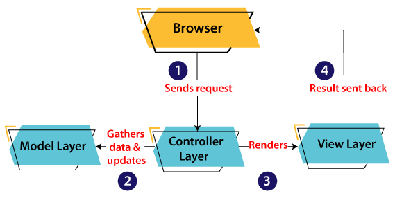
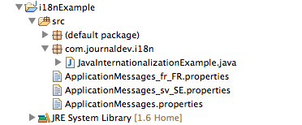

# 1. Design Patterns (Continued)

## 1.6. Observer

Observer is a behavioral design pattern. It specifies communication between objects: observable and observers. **An observable is an object which notifies observers about the changes in its state.**

For example, a news agency can notify channels when it receives news. Receiving news is what changes the state of the news agency, and it causes the channels to be notified.

### 1.6.1. Observer Example

Let's see how we can implement it ourselves.

First, we'll define the `NewsAgency` class:

```java
public class NewsAgency {
    private String news;
    private List<Channel> channels = new ArrayList<>();

    public void addObserver(Channel channel) {
        this.channels.add(channel);
    }

    public void removeObserver(Channel channel) {
        this.channels.remove(channel);
    }

    public void setNews(String news) {
        this.news = news;
        for (Channel channel : this.channels) {
            channel.update(this.news);
        }
    }
}
```

`NewsAgency` is an observable, and when news gets updated, the state of `NewsAgency` changes. When the change happens, `NewsAgency` notifies the observers about it by calling their update() method.

**To be able to do that, the observable object needs to keep references to the observers.** In our case, it's the channels variable.

Now let's see what the observer, the Channel class, can look like. It should have the update() method, which is invoked when the state of `NewsAgency` changes:

```java
public class NewsChannel implements Channel {
    private String news;

    @Override
    public void update(Object news) {
        this.setNews((String) news);
    }

    // standard getter and setter
}
```

The `Channel` interface has only one method:

```java
public interface Channel {
    public void update(Object o);
}
```

Now if we add an instance of NewsChannel to the list of observers, and change the state of NewsAgency, the instance of NewsChannel will be updated:

```java
NewsAgency observable = new NewsAgency();
NewsChannel observer = new NewsChannel();

observable.addObserver(observer);
observable.setNews("news");
assertEquals(observer.getNews(), "news");
```

There's a predefined Observer interface in Java core libraries, which makes implementing the observer pattern even more simple. Let's look at it.

### 1.6.2. Implementation With Observer

The java.util.Observer interface defines the update() method, so there's no need to define it ourselves, as we did in the previous section.

Let's see how we can use it in our implementation:

```java
public class ONewsChannel implements Observer {

    private String news;

    @Override
    public void update(Observable o, Object news) {
        this.setNews((String) news);
    }

    // standard getter and setter
}
```

Here, the second argument comes from Observable, as we'll see below.

To define the observable, we need to extend Java's Observable class:

```java
public class ONewsAgency extends Observable {
    private String news;

    public void setNews(String news) {
        this.news = news;
        setChanged();
        notifyObservers(news);
    }
}
```

Note that we don't need to call the observer's `update()` method directly. We just call `setChanged()` and `notifyObservers()`, and the `Observable class` will do the rest for us.

It also contains a list of observers and exposes methods to maintain that list, `addObserver()` and `deleteObserver()`.

To test the result, we just need to add the observer to this list and set the news:

```java
ONewsAgency observable = new ONewsAgency();
ONewsChannel observer = new ONewsChannel();

observable.addObserver(observer);
observable.setNews("news");
assertEquals(observer.getNews(), "news");
```

The Observer interface isn't perfect, and has been deprecated since Java 9. One of the cons is that Observable isn't an interface, it's a class, and that's why subclasses can't be used as observables.

### 1.6.3. More example

```java
public interface Subject {
	void subscrible(Subscriber sub);
	void unSubscrible(Observer sub);
	void notifySubscribers();
	void sendMail(String title);
}
```

```java
public interface Observer {
	void update();
	void subscribleMailingList(MailingList mailingList);
}
```

```java
public class Subscriber implements Observer {
	private String name;
	private MailingList mailingList = new MailingList();

	public Subscriber(String name) {
		this.name = name;
	}

	@Override
	public void update() {
		System.out.println("Hey " + name + " Mail sent, title: " + mailingList.title);
	}

	@Override
	public void subscribleMailingList(MailingList mailingList) {
		this.mailingList = mailingList;
	}

}
```

```java
import java.util.ArrayList;
import java.util.List;

public class MailingList implements Subject {

	private List<Subscriber> subs = new ArrayList<>();
	String title;

	@Override
	public void subscrible(Subscriber sub) {
		subs.add(sub);
	}

	@Override
	public void unSubscrible(Observer sub) {
		subs.remove(sub);
	}

	@Override
	public void notifySubscribers() {
		for(Observer sub : subs) {
			sub.update();
		}
	}

	@Override
	public void sendMail(String title) {
		this.title = title;
		notifySubscribers();
	}

}
```

```java
public class AdinMailingList {

	public static void main(String[] args) {
		MailingList adinMailingList = new MailingList();

		Subscriber s1 = new Subscriber("James");
		Subscriber s2 = new Subscriber("Jordan");
		Subscriber s3 = new Subscriber("Claudia");
		Subscriber s4 = new Subscriber("Audrey");
		Subscriber s5 = new Subscriber("Jenny");

		adinMailingList.subscrible(s1);
		adinMailingList.subscrible(s2);
		adinMailingList.subscrible(s3);
		adinMailingList.subscrible(s4);
		adinMailingList.subscrible(s5);

		// adinMailingList.unSubscrible(s4);

		s1.subscribleMailingList(adinMailingList);
		s2.subscribleMailingList(adinMailingList);
		s3.subscribleMailingList(adinMailingList);
		s4.subscribleMailingList(adinMailingList);
		s5.subscribleMailingList(adinMailingList);

		adinMailingList.sendMail("New tutorial");
	}
}
```

## 1.7. MVC (Model-View-Controller)

The Model-View-Controller (MVC) is a well-known design pattern in the web development field. It is way to organize our code. It specifies that a program or application shall consist of data model, presentation information and control information. The MVC pattern needs all these components to be separated as different objects.

In this section, we will discuss the MVC Architecture in Java, alongwith its advantages and disadvantages and examples to understand the implementation of MVC in Java.

### 1.7.1. What is MVC architecture in Java?

The model designs based on the MVC architecture follow MVC design pattern. The application logic is separated from the user interface while designing the software using model designs.

The MVC pattern architecture consists of three layers:

- **Model:** It represents the business layer of application. It is an object to carry the data that can also contain the logic to update controller if data is changed.

- **View:** It represents the presentation layer of application. It is used to visualize the data that the model contains.

- **Controller:** It works on both the model and view. It is used to manage the flow of application, i.e. data flow in the model object and to update the view whenever data is changed.

In Java Programming, the Model contains the simple Java classes, the View used to display the data and the Controller contains the servlets. Due to this separation the user requests are processed as follows:



1. A client (browser) sends a request to the controller on the server side, for a page.
2. The controller then calls the model. It gathers the requested data.
3. Then the controller transfers the data retrieved to the view layer.
4. Now the result is sent back to the browser (client) by the view.

### 1.7.2. Advantages of MVC Architecture

The advantages of MVC architecture are as follows:

- MVC has the feature of scalability that in turn helps the growth of application.
- The components are easy to maintain because there is less dependency.
- A model can be reused by multiple views that provides reusability of code.
- The developers can work with the three layers (Model, View, and Controller) simultaneously.
- Using MVC, the application becomes more understandable.
- Using MVC, each layer is maintained separately therefore we do not require to deal with massive code.
- The extending and testing of application is easier.

### 1.7.2. Implementation of MVC using Java

To implement MVC pattern in Java, we are required to create the following three classes.

- **Employee Class**, will act as model layer
- **EmployeeView Class**, will act as a view layer
- **EmployeeContoller Class**, will act a controller layer

### 1.7.3. MVC Architecture Layers

**Model Layer**
The Model in the MVC design pattern acts as a data layer for the application. It represents the business logic for application and also the state of application. The model object fetch and store the model state in the database. Using the model layer, rules are applied to the data that represents the concepts of application.

Let's consider the following code snippet that creates a which is also the first step to implement MVC pattern.

**Employee.java**

```java
// class that represents model
public class Employee {

      // declaring the variables
       private String EmployeeName;
       private String EmployeeId;
       private String EmployeeDepartment;

      // defining getter and setter methods
       public String getId() {
          return EmployeeId;
       }

       public void setId(String id) {
          this.EmployeeId = id;
       }

       public String getName() {
          return EmployeeName;
       }

       public void setName(String name) {
          this.EmployeeName = name;
       }

       public String getDepartment() {
              return EmployeeDepartment;
           }

       public void setDepartment(String Department) {
              this.EmployeeDepartment = Department;
           }

    }
```

The above code simply consists of getter and setter methods to the Employee class.

**View Layer**

As the name depicts, view represents the visualization of data received from the model. The view layer consists of output of application or user interface. It sends the requested data to the client, that is fetched from model layer by controller.

Let's take an example where we create a view using the EmployeeView class.

**EmployeeView.java**

```java
// class which represents the view
public class EmployeeView {

      // method to display the Employee details
public void printEmployeeDetails (String EmployeeName, String EmployeeId, String EmployeeDepartment){
          System.out.println("Employee Details: ");
          System.out.println("Name: " + EmployeeName);
          System.out.println("Employee ID: " + EmployeeId);
          System.out.println("Employee Department: " + EmployeeDepartment);
       }
    }
```

**Controller Layer**

The controller layer gets the user requests from the view layer and processes them, with the necessary validations. It acts as an interface between Model and View. The requests are then sent to model for data processing. Once they are processed, the data is sent back to the controller and then displayed on the view.

Let's consider the following code snippet that creates the controller using the EmployeeController class.

**EmployeeController.java**

```java
// class which represent the controller
public class EmployeeController {

      // declaring the variables model and view
       private Employee model;
       private EmployeeView view;

      // constructor to initialize
       public EmployeeController(Employee model, EmployeeView view) {
          this.model = model;
          this.view = view;
       }

      // getter and setter methods
       public void setEmployeeName(String name){
          model.setName(name);
       }

       public String getEmployeeName(){
          return model.getName();
       }

       public void setEmployeeId(String id){
          model.setId(id);
       }

       public String getEmployeeId(){
          return model.getId();
       }

       public void setEmployeeDepartment(String Department){
              model.setDepartment(Department);
       }

           public String getEmployeeDepartment(){
              return model.getDepartment();
       }

       // method to update view
       public void updateView() {
          view.printEmployeeDetails(model.getName(), model.getId(), model.getDepartment());
       }
    }
```

**Main Class Java file**

The following example displays the main file to implement the MVC architecture. Here, we are using the MVCMain class.

**MVCMain.java**

```java
// main class
public class MVCMain {
       public static void main(String[] args) {

          // fetching the employee record based on the employee_id from the database
          Employee model = retriveEmployeeFromDatabase();

          // creating a view to write Employee details on console
          EmployeeView view = new EmployeeView();

          EmployeeController controller = new EmployeeController(model, view);

          controller.updateView();

          //updating the model data
          controller.setEmployeeName("Nirnay");
          System.out.println("\n Employee Details after updating: ");

          controller.updateView();
       }

       private static Employee retriveEmployeeFromDatabase(){
          Employee Employee = new Employee();
          Employee.setName("Anu");
          Employee.setId("11");
          Employee.setDepartment("Salesforce");
          return Employee;
       }
    }
```

The **MVCMain** class fetches the employee data from the method where we have entered the values. Then it pushes those values in the model. After that, it initializes the view (EmployeeView.java). When view is initialized, the Controller (EmployeeController.java) is invoked and bind it to Employee class and EmployeeView class. At last the updateView() method (method of controller) update the employee details to be printed to the console.

**Output:**


# 2. Internationalization (I18n)

Internationalization in Java or Java i18n is a very important feature. Java provides internationalization (i18n) support through resource bundles.

For making your application support different locales, we need to create locale specific properties file. The file names follow the pattern of bundle name with language code and country code, for example ApplicationMessages_en_US.properties. Once the property files for specific locales are ready, all you need to do is initialize the resource bundle with correct Locale. Java provides two classes java.util.ResourceBundle and java.util.Locale that are used for this purpose. ResourceBundle reads the locale specific property file and you can get the locale specific value for any key. This is very helpful in making your web application texts locale specific, you can get the locale information from the HTTP request and generate the dynamic page with that locale resource bundle files. You can also provide option to user to chose the locale and update the labels dynamically.



Here is the java code for **JavaInternationalizationExample** class.

```java
import java.util.Locale;
import java.util.ResourceBundle;

public class JavaInternationalizationExample {

    public static void main(String[] args) {
        //default locale
        ResourceBundle bundle = ResourceBundle.getBundle("ApplicationMessages");
        //Get ResourceBundle with Locale that are already defined
        ResourceBundle bundleFR = ResourceBundle.getBundle("ApplicationMessages", Locale.FRANCE);
        //Get resource bundle when Locale needs to be created
        ResourceBundle bundleSWE = ResourceBundle.getBundle("ApplicationMessages", new Locale("sv", "SE"));

        //lets print some messages
        printMessages(bundle);
        printMessages(bundleFR);
        printMessages(bundleSWE);

    }

    private static void printMessages(ResourceBundle bundle) {
        System.out.println(bundle.getString("CountryName"));
        System.out.println(bundle.getString("CurrencyCode"));
    }

}
```

Here bundle name is `ApplicationMessages` and I have 2 locale specific resource bundles and one default resource bundle. `ApplicationMessages.properties`.

```
CountryName=USA
CurrencyCode=USD
```

`ApplicationMessages_fr_FR.properties`

```
CountryName=France
CurrencyCode=Euro
```

`ApplicationMessages_sv_SE.properties`

```
CountryName=Sweden
CurrencyCode=Kr
```

Notice the use of Locale class, there are some locales already defined but we can always create new locale by passing language code and country code to it’s constructor. When I run the above program, here is the output.

```
USA
USD
France
Euro
Sweden
Kr
```
